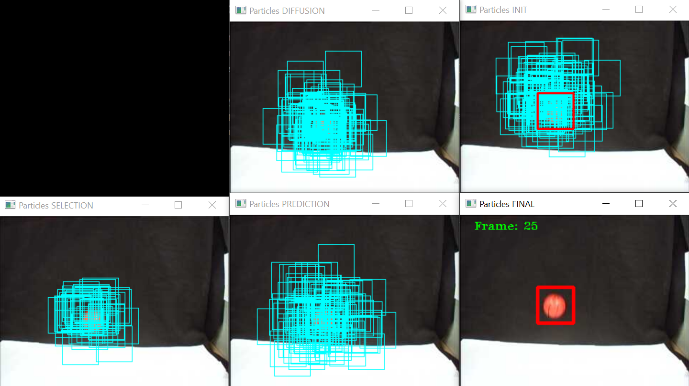
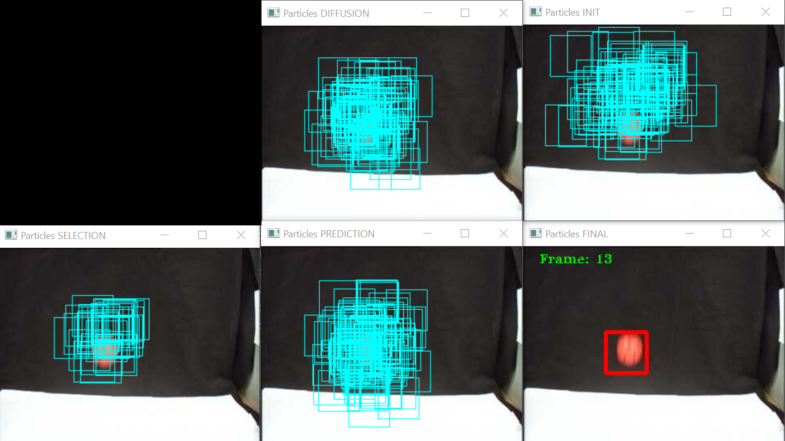

# PARTICLE FILTER
# Implementation of particle filter using Python.

## AUTOR
* [**VICENTE GILABERT MAÑO**](https://www.linkedin.com/in/vgilabert/)

## FILES
* **particle_filter.py:** Execute code to follow red ball. Particle size (M) and particle number (N) can be configured. 

## REPORT
Read the full report (spanish) -> [PDF](docs/report.pdf)

#### RESULTS

